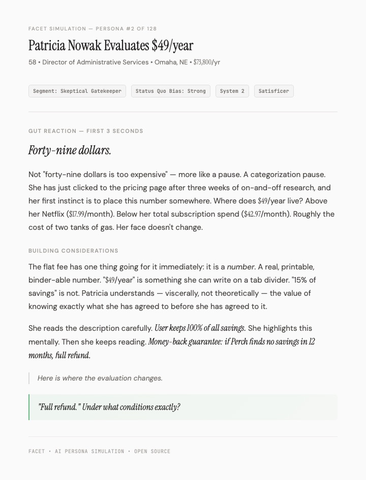

# Facet

Generate hundreds of AI personas with real behavioral psychology. Simulate them through your pricing page, your copy, your feature set. Watch them reason through the decision.

The verdict isn't the point. The reasoning is.



*Persona #2 of 128. A 58-year-old school administrator in Omaha encounters a $49/year subscription. Her first instinct isn't to evaluate the price — it's to check the refund terms. The reasoning traces back to a home warranty claim denied on a technicality in 2011.*

---

## What This Produces

You describe a product. Facet generates a population of psychologically detailed personas — each with a specific income, decision style, existing subscriptions, and a reason they might say no. Then it runs each one through your pricing, copy, or feature decisions.

Each persona gets:
- **Behavioral economics profile** — reference point, loss aversion, mental accounting, subscription fatigue, status quo bias
- **Decision simulation** — a four-step emotional arc (gut reaction → building considerations → moment of doubt → resolution)
- **Verdict** — beliefs, desires, intentions, and a representative quote in their own voice

The synthesis across all personas includes confidence grading, a sycophancy audit, a pre-mortem failure narrative, and a validation plan for what to test with real users.

## What This Is (and Isn't)

Facet generates hypotheses, not evidence. The output looks like a $50K research engagement — rich narratives, specific numbers, emotional arcs — but it's all generated by an LLM that has never met a real user.

**Good for:** Thinking through product bets before you commit resources. Identifying objections you hadn't considered. Stress-testing pricing models and copy variants. Preparing sharper questions for real user interviews.

**Not good for:** Final pricing decisions. Go/no-go launch calls. Feature priority rankings (LLMs care about everything equally). Non-Western or underrepresented populations.

The accuracy hierarchy is clear:

| Approach | Accuracy | Example |
|----------|----------|---------|
| Interview-grounded agents | ~85% | Simile ($100M Series A) |
| Fine-tuned on survey data | ~78-88% | Qualtrics Edge Audiences |
| Census-calibrated panels | ~75-92% | Ditto, Toluna |
| Rich prompting | ~70-75% | **Facet** |
| Naive LLM query | ~63% | "Hey ChatGPT, would you buy this?" |

Facet is in the fourth row. That's honest. It's also a meaningful step up from asking ChatGPT, and it's free, open source, and auditable.

---

## Quick Start

```bash
git clone https://github.com/saraswatayu/facet.git
cd facet
./setup

# 1. Generate personas for your product
./sim.sh init --config examples/superhuman-product.md --name superhuman

# 2. Run exercises against those personas
./sim.sh exercise --study output/superhuman/ --config examples/superhuman-pricing.md
./sim.sh exercise --study output/superhuman/ --config examples/superhuman-copy.md

# 3. Check status
./sim.sh status --study output/superhuman/
```

Personas are generated once and reused across exercises. A pricing exercise and a copy exercise share the same persona backgrounds.

### Options

| Flag | Description | Default |
|------|-------------|---------|
| `--config` | Product config (init) or exercise config (exercise) | required |
| `--name` | Study name for output directory | config filename |
| `--study` | Path to existing study directory | — |
| `--concurrency` | Parallel persona generations/simulations | 5 |
| `--calibration` | Real research data to ground personas ([details](#calibration)) | — |

---

## How It Works

```
INIT — run once per product
┌──────────┐      ┌──────────────────────────────────┐
│  PLAN    │      │  GENERATE (parallel, in waves)    │
│          │─────▶│                                    │
│ segments │      │  1 claude call per persona         │
│ personas │      │  wave-based diversity context      │
│ matrix   │      │  behavioral economics profiles     │
└──────────┘      └──────────────────────────────────┘

EXERCISE — repeat for pricing, copy, features, onboarding, retention
┌──────────────────────────┐      ┌──────────────────┐
│  SIMULATE (parallel)     │      │  ANALYZE         │
│                          │─────▶│                  │
│  Chain-of-Feeling arcs   │      │  synthesis.md    │
│  BDI verdicts            │      │  artifacts.md    │
│  deal-breaker enforcement│      │  counterargument │
└──────────────────────────┘      └──────────────────┘
```

### Plan

Reads your product config. Generates segments based on jobs-to-be-done (not just demographics — research shows demographics explain only ~1.5% of response variance). Each persona gets a constraint vector:

```
Persona #7 — Segment: Replacing a Manual Workaround
Name: Marcus | Age: 41 | City: Boise, ID | Job: Operations Manager
Income range: $72-88k | Household: married, two kids
Big Five: O:5 C:8 E:4 A:3 N:5
Decision style: optimizer | Adoption stage: early majority
Status quo bias: strong | Processing mode: System 2
Current solution: custom spreadsheet he's maintained for 3 years
Deal-breakers: won't give any service access to his email account
```

### Generate

One Claude call per persona, in parallel waves of 5. Each wave sees summaries of previously generated personas to prevent homogeneity. Anti-sycophancy rules at every phase — personas are explicitly permitted to reject the product.

### Simulate

Each persona walks through your pricing page / copy / features with a four-step emotional arc: gut reaction, building considerations, moment of doubt, resolution. Deal-breakers from the background are enforced — not every persona converts.

### Analyze

Reads all personas + simulations. Produces:
- **synthesis.md** — confidence-graded findings, behavioral mechanism analysis, stated vs. revealed preference gaps, sycophancy audit, pre-mortem, counterargument
- **artifacts.md** — usable copy, FAQ from objections, segment marketing angles, referral templates, validation plan

---

## Config Format

### Product Config (for `init`)

```yaml
---
segments: 10
personas_per_segment: 5
---

# Product: Superhuman

Superhuman is a premium email client built for speed...

## Key Product Details
- $30/month per user, works with Gmail and Outlook
- AI features: summarize threads, draft replies, auto-triage

## Target Market
- Startup founders and CEOs
- Sales professionals
```

### Exercise Config (for `exercise`)

```yaml
---
exercise_name: pricing-tiers
study_type: pricing
options:
  - name: "Model A"
    description: "$30/month flat — current pricing"
  - name: "Model B"
    description: "Free tier + $30/month Pro"
copy_variants: true
---

## Options to Test

### Model A: $30/month flat (status quo)
One plan, one price, every feature...

## Copy Variants

### Variant A: "Premium, Unapologetic"
$30/month. The fastest email experience ever made.
```

Study types: `pricing`, `copy`, `features`, `onboarding`, `retention`

---

## Calibration

Ground personas in real research data instead of relying solely on LLM priors:

```bash
# Single file
./sim.sh init --config product.md --name study --calibration survey-results.md

# Directory of research files
./sim.sh init --config product.md --name study --calibration ./research-data/
```

For directories, add a `manifest.md` at the root describing each file's purpose. The plan phase reads relevant files and documents what it extracted in a "Calibration Sources" audit trail.

---

## Research Foundation

Templates are grounded in ~490 academic sources across six research areas. The short version:

- **LLM personas are sycophantic.** They agree with you. Templates include anti-sycophancy rules at every phase, explicit permission to reject, and adversarial review that tries to break the recommendation. (Sharma et al., ICLR 2024)
- **LLM personas are homogeneous.** 30-50% less variance than real humans. Wave-based generation with diversity context, constraint vectors, and a diversity matrix with concentration thresholds. (Bisbee et al., 2024)
- **LLMs don't naturally produce human decision biases.** Only 17-57% consistency. Explicit behavioral economics parameters per persona: loss aversion, mental accounting, subscription fatigue, status quo bias. (arXiv:2509.22856)
- **Demographics explain almost nothing.** 1.5% of response variance. Segments use jobs-to-be-done. Personas use values and behavioral profiles, not just age/income. (SCOPE framework, arXiv:2601.07110)

Full reports in `research/`.

---

## Output Structure

```
output/{product}/
├── plan.md                    # segments, constraint vectors, diversity matrix
├── personas/                  # generated once, reused
│   ├── persona-001.md
│   └── ...
└── exercises/
    └── {exercise-name}/
        ├── simulations/
        │   ├── persona-001.md # decision arcs, verdicts
        │   └── ...
        ├── synthesis.md       # analysis + counterargument
        └── artifacts.md       # deliverables + validation plan
```

## Known Limitations

- **Illusion of depth.** "$38,500/year, $18.50/hour" is plausible fiction, not data. The richer the output, the easier it is to forget this.
- **Can't know what it can't know.** Real users have DIY workarounds and half-formed habits no LLM can simulate.
- **Config bias.** If your exercise config describes Option A more favorably, the entire simulation leans toward A.
- **Run-to-run variance.** Identical parameters can produce different results.
- **WEIRD bias.** LLMs are overtrained on English-language, Western, educated, middle-class perspectives.

## Requirements

- [Claude CLI](https://docs.anthropic.com/en/docs/claude-cli) (`claude` command available)
- Python 3 (for `stream_filter.py`)
- Bash

Run `./setup` to verify dependencies.

## License

MIT
